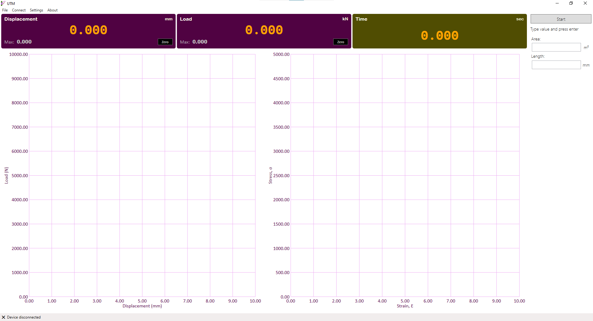

# Universal Testing Machine

The application provides capability to communicate with hardware to gather analog to digitally converted values at different points from a UTM, and presents them charts in real-time.

<!-- -->

